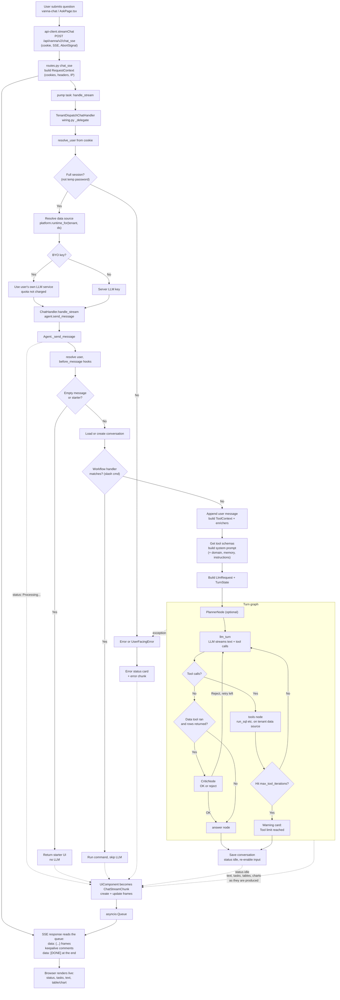
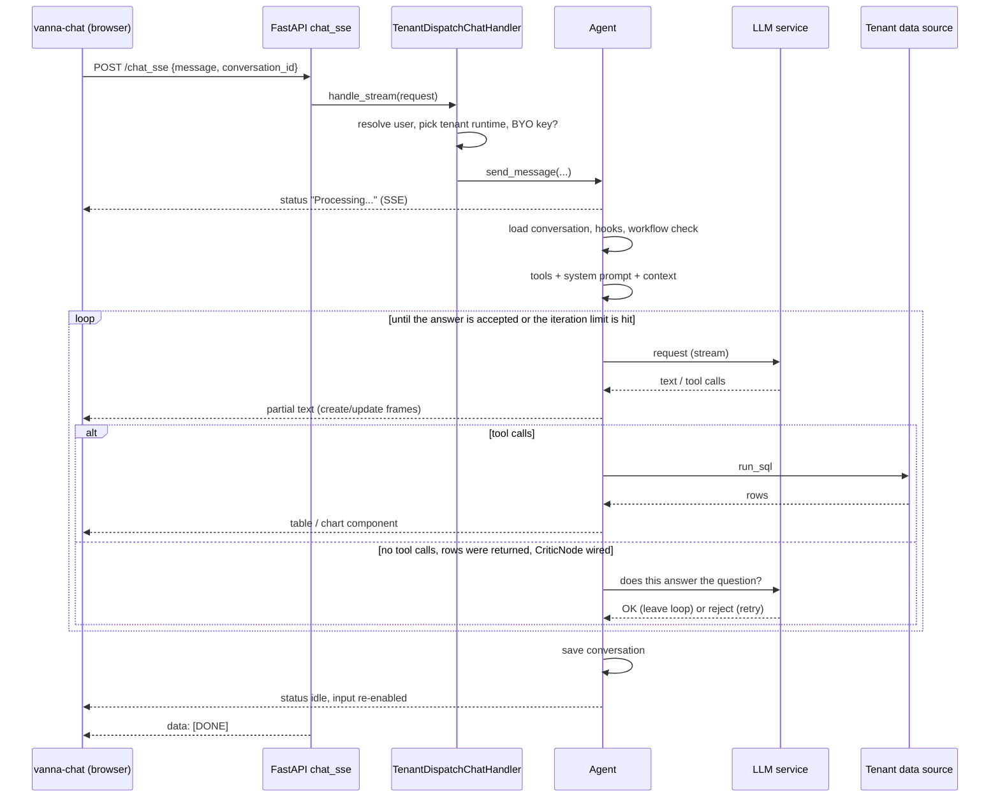

# Chat request flow: what happens when a question is submitted

> **Viewing the diagrams:** GitHub renders the Mermaid blocks below natively. VS Code's built-in preview does not; install the *Markdown Preview Mermaid Support* extension (`bierner.markdown-mermaid`), or open [request-flow.html](request-flow.html) in a browser, which renders both diagrams standalone.

## Summary

1. **Browser**: `<vanna-chat>` POSTs to `/api/vanna/v2/chat_sse` with the session cookie (`frontend/src/services/api-client.ts`, `streamChat`).
2. **FastAPI route**: `chat_sse` (`backend/vanna/servers/fastapi/routes.py`) builds a `RequestContext` and runs the handler in a background task. Chunks go over a queue, with keepalive comments and a final `data: [DONE]`.
3. **Tenant dispatch**: `TenantDispatchChatHandler` (`backend/vanna_app/wiring.py`) resolves the user, requires a full session, picks the tenant and data-source runtime, and optionally swaps in the user's own LLM key.
4. **Agent**: `Agent._send_message` (`backend/vanna/core/agent/agent.py`) runs hooks, loads the conversation, tries the workflow handler (slash commands), builds the tool context, tool schemas and system prompt, then runs the turn graph.
5. **Turn graph**: `llm_turn -> tools -> llm_turn ... -> answer`, stopping early with a warning card if `max_tool_iterations` is reached. Optional `PlannerNode` and `CriticNode` live in `backend/vanna_app/agent_nodes.py`.
6. **Response**: every `UiComponent` becomes a `ChatStreamChunk` (create and update frames) as soon as it is produced, and is streamed back as SSE while the turn is still running. The browser renders status, tasks, text and tables or charts live.

## Flowchart

Solid arrows are control flow. Dotted arrows are UI output that is streamed to the browser as it happens.

## Sequence diagram

## Not covered

The internals of the `run_sql` tool, system-prompt and memory enrichment, row-level guards (`read_guard.py`, `authz.py`), and quota and audit handling are shown as single boxes and were not traced.